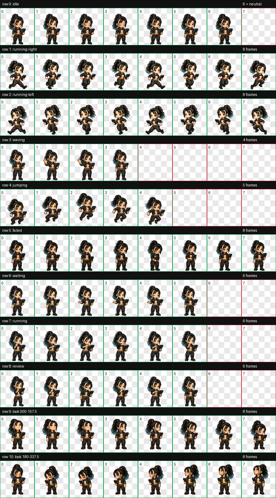

# dai（odai）Codex 桌宠

这是可直接安装的 Codex v2 桌宠分发包。

## 安装

将整个 `pets/dai` 目录复制到用户目录下的 `.codex/pets/dai`：

- Windows：`%USERPROFILE%\.codex\pets\dai`
- macOS / Linux：`~/.codex/pets/dai`

发布目录保持精简：

```text
dai/
├── README.md
├── contact-sheet.png
├── pet.json
└── spritesheet.webp
```

Codex 实际只读取 `pet.json` 和 `spritesheet.webp`；其余两个文件用于安装说明和动作预览。

然后在 Codex 中打开 `Settings → Pets`，点击刷新并选择 `dai`。也可以使用 `/pet` 打开桌宠选择。

## 规格

- 桌宠 ID：`dai`
- 图集协议：`spriteVersionNumber: 2`
- 图集尺寸：`1536 × 2288`
- 单帧尺寸：`192 × 208`
- 布局：8 列 × 11 行
- 动作：9 组标准动画与 16 个观察方向
- 原生关键格：73 个协议帧，另含 1 个中性观察参考格

Codex 当前客户端会按固定行读取每组动画（每组 4–8 个关键格），帧数与播放间隔不能通过 `pet.json` 自定义。非待机动作会先循环三次，再切回待机；因此每行使用不同的首尾衔接姿势组成闭环，没有用重复待机画面冒充补帧。显示器可以 60 Hz 刷新，但原生桌宠并不是每秒 60 张独立原画。

## 尺度与动作注册

- 9 组标准动作与 16 个观察方向统一到同一角色母版尺度；待机可见高度为 171 px，跑步因压腿/抬腿姿势在 165–171 px 间变化，但头脸、躯干和终端没有整体缩放。
- 跳跃保持头脸、躯干、终端和腰带比例不变，只用姿势与 Y 轴轨迹表现起跳、腾空和落地。
- 右跑使用“接触 → 压缩 → 交叉 → 抬腿”的完整节奏并以另一条同材质黑色腿重复半周期；左跑由最终右跑逐帧镜像且保持时间顺序。两行均在单元格内原地闭环，不把位移烘焙进图集。
- `running` 是持续操作终端的执行任务循环；`review` 是托腮、凝视终端的审阅循环，两者不是重复动作。

## 观察方向触发

图集提供完整的 16 向观察格。当前核验的 Codex Windows `26.803.5235.0` 会在桌宠收到 computer-use 光标位置或通知回复输入框的光标位置时选择这些格；普通系统鼠标的全局位置不是 `pet.json` 或静态图集能够开启的行为。也就是说，本包保证 16 向资源和角度顺序正确，但不能让当前 Codex 运行时新增“始终跟随物理鼠标”的能力。

## 预览


