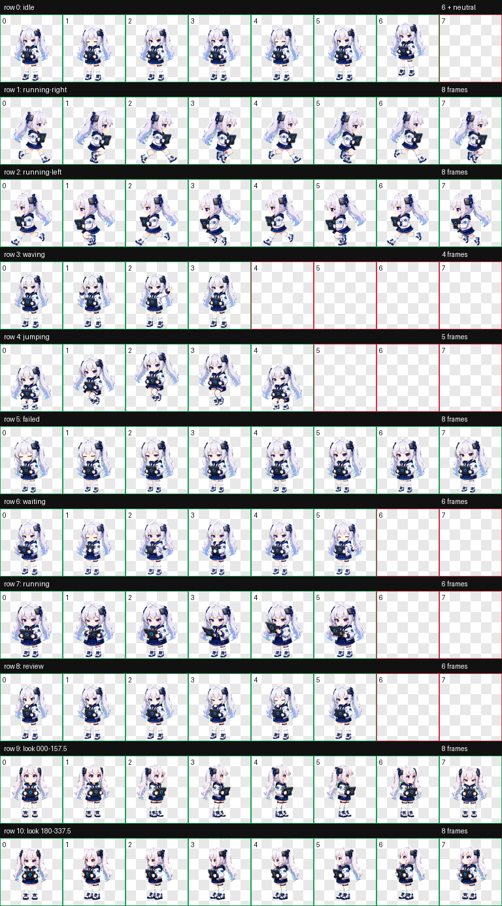

# odai（白色版）Codex 桌宠

这是可直接安装的 Codex v2 桌宠分发包，与黑色版 `dai` 分开安装和选择。

## 安装

将整个 `pets/odai` 目录复制到用户目录下的 `.codex/pets/odai`：

- Windows：`%USERPROFILE%\.codex\pets\odai`
- macOS / Linux：`~/.codex/pets/odai`

发布目录保持精简：

```text
odai/
├── README.md
├── contact-sheet.png
├── pet.json
└── spritesheet.webp
```

Codex 实际只读取 `pet.json` 和 `spritesheet.webp`；其余两个文件用于安装说明和动作预览。

然后在 Codex 中打开 `Settings → Pets`，点击刷新并选择 `odai`。也可以使用 `/pet` 打开桌宠选择。

## 规格

- 桌宠 ID：`odai`
- 图集协议：`spriteVersionNumber: 2`
- 图集尺寸：`1536 × 2288`
- 单帧尺寸：`192 × 208`
- 布局：8 列 × 11 行
- 动作：9 组标准动画与 16 个观察方向
- 协议占用格：58 个标准动作格与 16 个观察方向格

Codex 客户端按固定行读取每组动画，每组使用 4–8 个关键格。显示器可以 60 Hz 刷新，但原生桌宠不是每秒 60 张独立原画，`pet.json` 也不能自定义播放帧率。

## 动作与尺度

- 所有标准动作使用同一角色母版体量和脚底注册；头脸、躯干与终端不会在动作中整体缩放。
- 跳跃只通过蹲伏、腾空姿势和 Y 轴轨迹表现起跳与落地，不靠缩小角色制造高度。
- 左右跑是方向相反的完整步态，均在单元格内原地闭环，没有把位移烘焙进图集。
- `running` 是持续操作终端的执行任务循环；`review` 是停下思考、专注审阅的循环，两者不是重复动作。
- 正左/正右使用稳定侧脸停帧，避免此前方向反转、体型跳变和锚点漂移。

## 观察方向触发

图集提供完整的 16 向观察格。当前 Codex 运行时会在桌宠收到 computer-use 光标位置或通知回复输入框的光标位置时选择这些格；普通系统鼠标的全局位置不是 `pet.json` 或静态图集能够开启的行为。

也就是说，本包保证 16 向资源和角度顺序正确，但不能让当前 Codex 运行时新增“始终跟随物理鼠标”的能力。

## 预览


